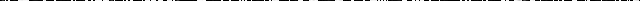

# Verilog Image Convolution

## Demo

| img/input.png               | img/output.png (first line)   |
|:---------------------------:|:-----------------------------:|
|  |  |

## Roadmap

- [x] byte conv_1d
- [x] pillow: to greyscale
- [ ] store image
- [ ] dynamic D, K
- [ ] test + CI
- [ ] float + multiplication  
  https://www.youtube.com/watch?v=bbkcEiUjehk&list=WL
- [ ] rgba + sequential logic  
  grey = 0.299 * R + 0.587 * G + 0.114 * B
- [ ] to greyscale
